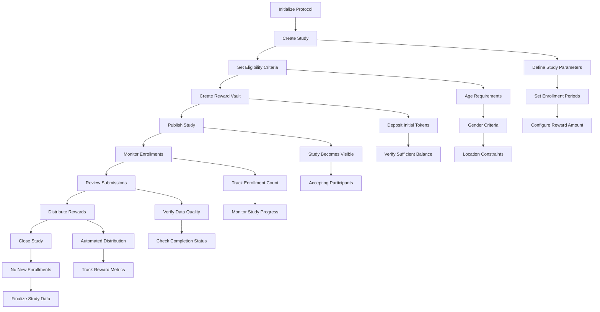
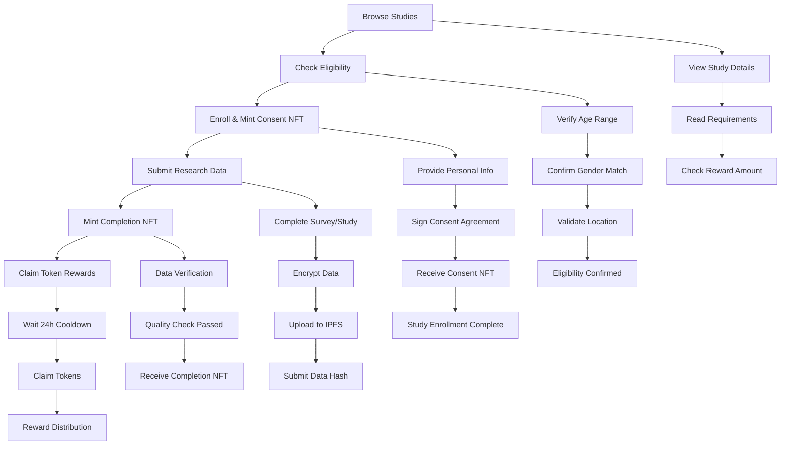
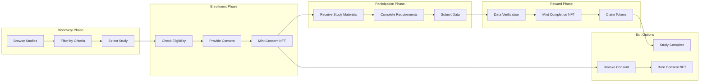

# RecruSearch

A decentralized research recruitment and data collection platform built on Solana using Anchor framework. RecruSearch enables researchers to conduct studies with transparent participant recruitment, on -chain consent, secure data collection, and automated reward distribution through NFTs and tokens.

## Project Overview

RecruSearch revolutionizes research recruitment by:
- **Decentralized Study Management**: Researchers can create, publish, and manage studies on-chain
- **NFT-Based Consent Management**: Participants mint consent NFTs upon enrollment
- **Secure Data Collection**: Encrypted data submission with IPFS storage
- **Automated Rewards**: Token-based incentives with completion NFTs
- **Transparent Governance**: Protocol-level admin controls and fee management

## Architecture

### Core Components

```
RecruSearch Protocol
├── Admin Layer (Protocol Governance)
├── Study Management (Creation, Publishing, State Transitions)
├── Participant Management (Enrollment, Eligibility, Consent)
├── Data Collection (Submission, Verification, Storage)
├── Reward System (Vaults, Distribution, NFTs)
└── Survey Schema Management (Structure, Finalization, Export)
```

### Technology Stack

- **Blockchain**: Solana
- **Framework**: Anchor (Rust)
- **NFT Standard**: MPL Core (Metaplex)
- **Token Standard**: SPL Token
- **Storage**: IPFS (decentralized)
- **Language**: Rust

## Core Functions

### 1. Protocol Administration
- **`initialize_protocol`**: Sets up protocol with configurable fees and duration limits
- **Protocol Configuration**: 
  - Protocol fee: 2.5% (default), max 10%
  - Study duration: 1 day to 1 year
  - Enrollment window: minimum 1 hour

### 2. Study Management
- **`create_study`**: Creates new research study with metadata and constraints
- **`publish_study`**: Makes study available for participant enrollment
- **`close_study`**: Permanently closes study to new enrollments
- **`transition_study_state`**: Automatic state transitions based on time

### 3. Participant Management
- **`set_eligibility_criteria`**: Defines participant requirements
- **`mint_consent_nft`**: Enrolls participants and mints consent NFTs
- **`revoke_consent`**: Allows participants to withdraw (burns NFT)

### 4. Data Collection
- **`submit_data`**: Submits encrypted research data with IPFS CID
- **`mint_completion_nft`**: Rewards participants with completion NFTs
- **`create_survey_schema`**: Defines survey structure and requirements
- **`finalize_survey_schema`**: Locks survey schema for data collection

### 5. Reward System
- **`create_reward_vault`**: Establishes token vault for study rewards
- **`distribute_reward`**: Transfers tokens to participants after verification

## User Flow & Interactions

### Researcher Workflow


### Participant Workflow


### Study Lifecycle States
```mermaid
graph TD
    Start([Start]) --> Draft[Draft State]
    Draft --> Published[Published State]
    Published --> Active[Active State]
    Active --> Closed[Closed State]
    Closed --> End([End])
    
    Draft --> Draft1[Study Created]
    Draft --> Draft2[Eligibility Set]
    Draft --> Draft3[Reward Vault Created]
    Draft --> Draft4[Not Visible to Participants]
    
    Published --> Published1[Accepting Enrollments]
    Published --> Published2[Participants Can Join]
    Published --> Published3[Consent NFTs Minted]
    Published --> Published4[Enrollment Period Active]
    
    Active --> Active1[Data Collection Active]
    Active --> Active2[Participants Submit Data]
    Active --> Active3[Completion NFTs Minted]
    Active --> Active4[Rewards Distributed]
    
    Closed --> Closed1[No New Enrollments]
    Closed --> Closed2[Data Collection Ended]
    Closed --> Closed3[Final Rewards Processed]
    Closed --> Closed4[Study Archived]
    
    Draft -.->|publish_study()| Published
    Published -.->|transition_study_state()| Active
    Active -.->|close_study()| Closed
    
    style Draft fill:#e1f5fe
    style Published fill:#f3e5f5
    style Active fill:#e8f5e8
    style Closed fill:#fff3e0
```

### Detailed Participant Journey


### Researcher Management Flow

```mermaid
graph LR
    subgraph "Study Creation"
        A[Initialize Protocol] --> B[Create Study]
        B --> C[Configure Parameters]
        C --> D[Set Eligibility]
        D --> E[Create Reward Vault]
    end
    
    subgraph "Study Management"
        E --> F[Publish Study]
        F --> G[Monitor Progress]
        G --> H[Adjust Parameters]
    end
    
    subgraph "Data Collection"
        H --> I[Review Submissions]
        I --> J[Verify Quality]
        J --> K[Approve Data]
    end
    
    subgraph "Study Completion"
        K --> L[Distribute Rewards]
        L --> M[Close Study]
        M --> N[Export Data]
    end
```


## Data Structures

### Core Accounts

#### AdminAccount
```rust
pub struct AdminAccount {
    pub protocol_admin: Pubkey,           // Protocol administrator
    pub protocol_fee_bps: u16,            // Protocol fee in basis points
    pub min_study_duration: u64,          // Minimum study duration
    pub max_study_duration: u64,          // Maximum study duration
    pub total_studies: u64,               // Total studies created
    pub total_participants: u64,          // Total participants enrolled
    pub total_rewards_distributed: u64,   // Total rewards distributed
    pub bump: u8,                         // PDA bump seed
}
```

#### StudyAccount
```rust
pub struct StudyAccount {
    pub study_id: u64,                    // Unique study identifier
    pub title: String,                    // Study title (max 100 chars)
    pub description: String,              // Study description (max 500 chars)
    pub researcher: Pubkey,               // Researcher's public key
    pub enrollment_start: i64,            // Enrollment start timestamp
    pub enrollment_end: i64,              // Enrollment end timestamp
    pub data_collection_end: i64,         // Data collection end timestamp
    pub max_participants: u32,            // Maximum participants allowed
    pub enrolled_count: u32,              // Current enrollment count
    pub reward_amount_per_participant: u64, // Reward per participant
    pub status: StudyStatus,              // Current study status
    pub completed_count: u32,             // Completed submissions count
    pub total_rewards_distributed: u64,   // Total rewards distributed
    pub created_at: i64,                  // Creation timestamp
    pub has_eligibility_criteria: bool,   // Eligibility criteria flag
    pub eligibility_criteria: Vec<u8>,    // Serialized eligibility data
    pub bump: u8,                         // PDA bump seed
}
```

#### ConsentAccount
```rust
pub struct ConsentAccount {
    pub study: Pubkey,                    // Associated study
    pub participant: Pubkey,              // Participant's public key
    pub eligibility_proof: Vec<u8>,       // Eligibility verification data
    pub timestamp: i64,                   // Consent timestamp
    pub is_revoked: bool,                 // Revocation status
    pub revocation_timestamp: Option<i64>, // Revocation timestamp
    pub nft_mint: Option<Pubkey>,         // Consent NFT mint address
    pub bump: u8,                         // PDA bump seed
}
```

#### SubmissionAccount
```rust
pub struct SubmissionAccount {
    pub study: Pubkey,                    // Associated study
    pub participant: Pubkey,              // Participant's public key
    pub encrypted_data_hash: [u8; 32],    // Hash of encrypted data
    pub ipfs_cid: String,                 // IPFS CID for data storage
    pub submission_timestamp: i64,        // Submission timestamp
    pub is_verified: bool,                // Verification status
    pub reward_distributed: bool,         // Reward distribution status
    pub completion_nft_mint: Option<Pubkey>, // Completion NFT mint
    pub bump: u8,                         // PDA bump seed
}
```

## Security Features

### Access Control
- **Researcher Authorization**: Only study creators can modify their studies
- **Participant Verification**: Consent accounts verify enrollment status
- **State Validation**: Study state transitions enforce business logic
- **PDA Security**: Program-derived addresses prevent unauthorized access

### Data Protection
- **Encrypted Submissions**: Data hashes ensure integrity
- **IPFS Storage**: Decentralized, censorship-resistant storage
- **NFT Verification**: Consent and completion NFTs prevent fraud
- **Time-based Constraints**: Enrollment and collection periods enforce deadlines

### NFT System

### Consent NFTs
- **Purpose**: Proof of study enrollment and consent
- **Attributes**: Study ID, title, consent date, researcher info
- **Metadata**: Stored on IPFS with dynamic attributes
- **Lifecycle**: Minted on enrollment, burned on revocation

### Completion NFTs
- **Purpose**: Achievement token for study completion
- **Attributes**: Study details, completion date, achievement type
- **Reward**: Unlocks token distribution eligibility
- **Permanent**: Cannot be revoked once minted

## Token Economics

### Reward Structure
- **Researcher Funding**: Initial deposit into reward vault
- **Participant Rewards**: Configurable per-participant amounts
- **Protocol Fees**: 2.5% default fee on study creation
- **Vault Management**: Automated token distribution

### Token Flow
```
Researcher → Reward Vault → Participant
     ↓              ↓           ↓
  Initial      Distribution   Completion
  Deposit      Automation     NFT + Tokens
```

### Installation
```bash
# Clone repository
git clone <repository-url>
cd RecruSearch

# Install dependencies
pnpm install

# Build program
anchor build

# Run tests
anchor test
```

### Configuration
```toml
# Anchor.toml
[provider]
cluster = "localnet"  # or "devnet", "mainnet"
wallet = "./programs/recru_search/Turbin3-wallet.json"

[programs.localnet]
recru_search = "HL4vrf5EV4eeaWyDLdzRgdjxxLiPfxiBvpWqjtKBPBNR"
mpl_core = "CoREENxT6tW1HoK8ypY1SxRMZTcVPm7R94rH4PZNhX7d"
```


### Key Dependencies
```toml
# Rust dependencies
mpl-core = "0.10.1"               # Metaplex NFT standard
anchor-spl = "0.31.1"             # SPL token integration
anchor-lang = "0.31.1"            # Anchor framework

# TypeScript dependencies
@coral-xyz/anchor = "^0.31.1"     # Anchor client
@solana/web3.js = "^1.98.2"       # Solana web3 client
@metaplex-foundation/mpl-core     # MPL Core client
```


## 📄 License

This project is licensed under the ISC License. See the LICENSE file for details.

*RecruSearch: Decentralizing Research Recruitment on Solana*
