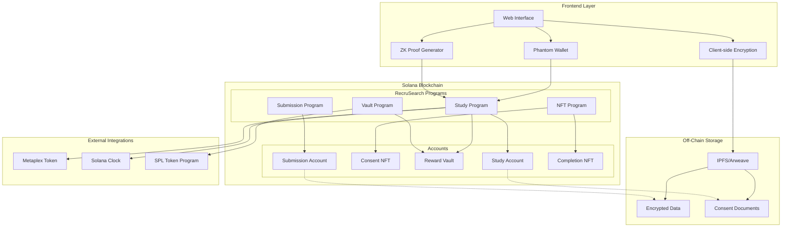
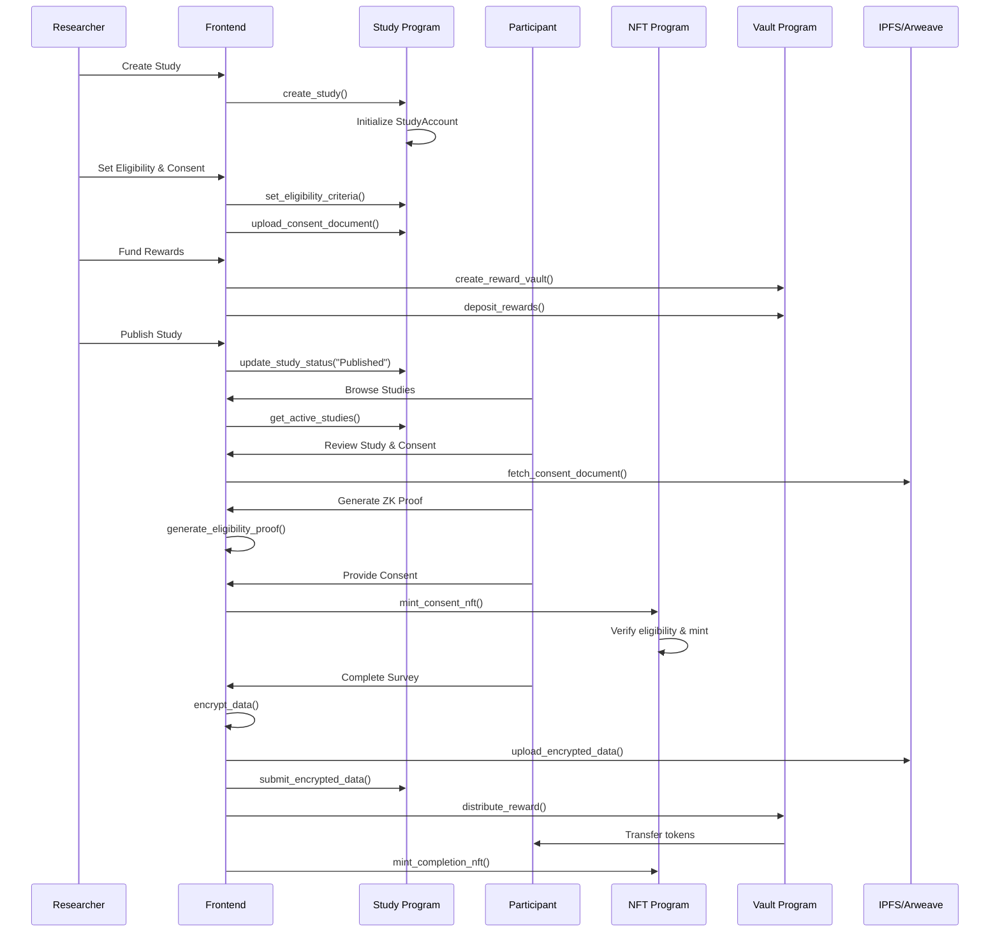
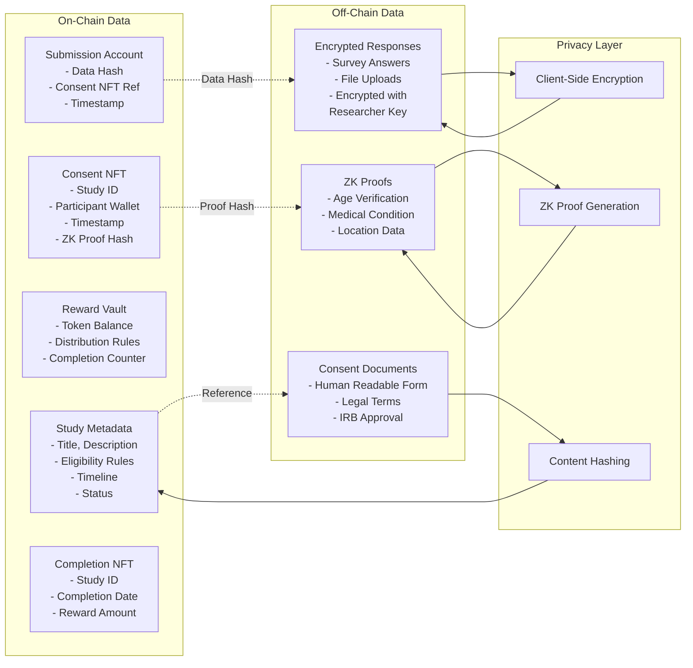

# RecruSearch Architecture Design

## Table of Contents
1. [Functions to be Built](#functions-to-be-built)
2. [Key Architectural Features](#key-architectural-features)
3. [Architecture Diagrams](#architecture-diagrams)
4. [Account Structures](#account-structures)
5. [Program Organization](#program-organization)

---

## Functions to be Built

### Core Smart Contract Functions

#### Study Management
- `create_study()` - Initialize new study with metadata
- `update_study_status()` - Change study status (draft → published → active → closed)
- `set_eligibility_criteria()` - Define participant requirements
- `upload_consent_document()` - Link consent form to study
- `close_study()` - End study and prevent new participants

#### Reward Management  
- `create_reward_vault()` - Initialize token escrow for study
- `deposit_rewards()` - Fund study with SPL tokens/NFTs
- `distribute_reward()` - Release tokens to participants upon completion
- `withdraw_remaining_funds()` - Return unused tokens to researcher

#### Consent & Participation
- `mint_consent_nft()` - Create verifiable consent record
- `verify_eligibility()` - Validate ZK proofs or Merkle inclusion
- `submit_encrypted_data()` - Record participant response hash
- `mint_completion_nft()` - Issue completion certificate

#### Query & Analytics
- `get_study_stats()` - Return enrollment and completion counts
- `query_consent_nfts()` - Retrieve participation records by study
- `get_participant_history()` - Show user's study participation
- `export_audit_logs()` - Generate compliance reports

#### Time-Based Management
- `check_study_timing()` - Validate current study phase
- `auto_transition_state()` - Move study through lifecycle phases
- `extend_enrollment()` - Modify study deadlines (authorized only)

### Frontend Functions

#### Wallet Integration
- `connect_phantom_wallet()` - Authenticate users
- `sign_message()` - Verify wallet ownership
- `handle_transaction()` - Process blockchain interactions

#### Study Interface
- `browse_studies()` - Display available research opportunities
- `filter_by_eligibility()` - Show relevant studies to user
- `display_consent_form()` - Render human-readable consent
- `encrypt_survey_data()` - Client-side encryption before submission

#### Data Management
- `upload_to_ipfs()` - Store encrypted responses off-chain
- `decrypt_researcher_data()` - Allow researchers to access their data
- `generate_zk_proof()` - Create eligibility proofs without revealing data

---

## Key Architectural Features

### 1. **Privacy-First Design**
- Client-side encryption using researcher's public key
- Zero-knowledge proofs for eligibility verification
- Pseudonymous participation via wallet addresses
- No PII stored on-chain

### 2. **Dual NFT System**
- **Consent NFTs**: Proof of informed consent and study entry
- **Completion NFTs**: Certificate of participation and reward claim

### 3. **Time-Bound State Management**
- Automated study lifecycle transitions
- Enrollment windows with start/end timestamps
- Grace periods for data submission

### 4. **Escrow-Based Rewards**
- Secure token vaults with conditional release
- Automatic distribution upon verified completion
- Protection against double-claiming

### 5. **Hybrid Storage Architecture**
- On-chain: Consent, metadata, state, proofs
- Off-chain: Encrypted survey data, consent documents
- References: IPFS/Arweave hashes stored on-chain

### 6. **Anti-Sybil Mechanisms**
- One consent NFT per wallet per study
- ZK proof validation for eligibility
- Merkle tree inclusion for batch verification

---

## Architecture Diagrams

### System Overview



### Study Lifecycle Flow



### Data Flow Architecture



---

## Account Structures

### Account Types Overview

#### **Program Derived Addresses (PDAs)**
*Owned by RecruSearch program, deterministic addresses*

- **StudyAccount** - Main study data and configuration
- **ConsentNFTAccount** - Consent record metadata  
- **RewardVault** - Reward escrow configuration
- **SubmissionAccount** - Encrypted data submission tracking
- **CompletionNFTAccount** - Completion certificate metadata
- **GlobalState** - Protocol-level configuration

#### **SPL Token Accounts**
*Owned by SPL Token Program, hold fungible tokens*

- **Vault Token Account** - Holds actual reward tokens (referenced in RewardVault)
- **Researcher Token Accounts** - Researcher's personal token wallets for funding
- **Participant Token Accounts** - Participant wallets for receiving rewards

#### **NFT Token Accounts (Metaplex Standard)**
*Special token accounts for non-fungible tokens*

- **Consent NFT Mint** - The actual consent NFT token
- **Consent NFT Associated Token Account** - Holds NFT in participant's wallet
- **Completion NFT Mint** - The actual completion certificate NFT
- **Completion NFT Associated Token Account** - Holds completion NFT in participant's wallet

#### **Standard Solana Accounts**
*Native Solana account types*

- **Researcher Wallet** - Researcher's main Phantom wallet account
- **Participant Wallet** - Participant's main Phantom wallet account

---

### Detailed Account Structures

### 1. StudyAccount (PDA)
**PDA Seeds:** `["study", researcher_pubkey, study_id]`

```rust
#[account]
pub struct StudyAccount {
    pub study_id: u64,                    // Unique study identifier
    pub researcher: Pubkey,               // Study creator/authority
    pub title: String,                    // Study title (max 100 chars)
    pub description: String,              // Study description (max 500 chars)
    pub consent_document_hash: [u8; 32],  // IPFS hash of consent form
    pub eligibility_merkle_root: [u8; 32], // Root for eligibility verification
    pub requires_zk_proof: bool,          // Whether ZK proof is required
    pub enrollment_start: i64,            // Unix timestamp for enrollment start
    pub enrollment_end: i64,              // Unix timestamp for enrollment end
    pub data_collection_end: i64,         // Unix timestamp for data collection end
    pub status: StudyStatus,              // Current study state
    pub max_participants: u32,            // Maximum number of participants
    pub reward_amount_per_participant: u64, // Reward per completion
    pub enrolled_count: u32,              // Number of consent NFTs minted
    pub completed_count: u32,             // Number of completed submissions
    pub reward_vault: Pubkey,             // Associated reward vault
    pub bump: u8,                         // PDA bump seed
}

#[derive(AnchorSerialize, AnchorDeserialize, Clone, PartialEq, Eq)]
pub enum StudyStatus {
    Draft,      // Study created but not published
    Published,  // Study published and accepting participants
    Active,     // Study in data collection phase
    Closed,     // Study completed, no new participants
    Archived,   // Study archived for long-term storage
}
```

### 2. ConsentNFTAccount (PDA)
**PDA Seeds:** `["consent", participant_pubkey, study_id]`

```rust
#[account]
pub struct ConsentNFTAccount {
    pub study_id: u64,                    // Reference to study
    pub participant: Pubkey,              // Participant wallet
    pub study_account: Pubkey,            // Reference to StudyAccount
    pub consent_timestamp: i64,           // When consent was given
    pub eligibility_proof_hash: [u8; 32], // Hash of ZK proof (if used)
    pub consent_document_version: [u8; 32], // Version of consent form agreed to
    pub metadata_uri: String,             // NFT metadata URI
    pub is_revoked: bool,                 // Whether consent was revoked
    pub bump: u8,                         // PDA bump seed
}
```

### 3. RewardVault (PDA)
**PDA Seeds:** `["vault", study_account, researcher_pubkey]`

```rust
#[account]
pub struct RewardVault {
    pub study_account: Pubkey,            // Associated study
    pub researcher: Pubkey,               // Vault authority
    pub token_mint: Pubkey,               // SPL token mint for rewards
    pub vault_token_account: Pubkey,      // Token account holding rewards
    pub total_deposited: u64,             // Total tokens deposited
    pub total_distributed: u64,           // Total tokens distributed
    pub rewards_per_completion: u64,      // Tokens per participant
    pub distribution_complete: bool,      // Whether all rewards distributed
    pub bump: u8,                         // PDA bump seed
}
```

### 4. SubmissionAccount (PDA)
**PDA Seeds:** `["submission", participant_pubkey, study_id]`

```rust
#[account]
pub struct SubmissionAccount {
    pub study_id: u64,                    // Reference to study
    pub participant: Pubkey,              // Participant wallet
    pub consent_nft: Pubkey,              // Reference to consent NFT
    pub encrypted_data_hash: [u8; 32],    // Hash of encrypted submission
    pub ipfs_cid: String,                 // IPFS content identifier
    pub submission_timestamp: i64,        // When data was submitted
    pub is_verified: bool,                // Whether submission is verified
    pub reward_claimed: bool,             // Whether reward was distributed
    pub completion_nft: Option<Pubkey>,   // Optional completion NFT reference
    pub bump: u8,                         // PDA bump seed
}
```

### 5. CompletionNFTAccount (PDA)
**PDA Seeds:** `["completion", participant_pubkey, study_id]`

```rust
#[account]
pub struct CompletionNFTAccount {
    pub study_id: u64,                    // Reference to study
    pub participant: Pubkey,              // Participant wallet
    pub submission_account: Pubkey,       // Reference to submission
    pub completion_timestamp: i64,        // When study was completed
    pub reward_amount: u64,               // Amount of reward received
    pub metadata_uri: String,             // NFT metadata URI
    pub study_title: String,              // Study title for reference
    pub bump: u8,                         // PDA bump seed
}
```

### 6. GlobalState (PDA)
**PDA Seeds:** `["global_state"]`

```rust
#[account]
pub struct GlobalState {
    pub admin: Pubkey,                    // Program admin
    pub total_studies: u64,               // Total number of studies created
    pub total_participants: u64,          // Total unique participants
    pub total_consent_nfts: u64,          // Total consent NFTs minted
    pub total_completion_nfts: u64,       // Total completion NFTs minted
    pub protocol_fee_basis_points: u16,   // Protocol fee (0-10000)
    pub fee_recipient: Pubkey,            // Where protocol fees go
    pub is_paused: bool,                  // Emergency pause mechanism
    pub bump: u8,                         // PDA bump seed
}
```

### 7. SPL Token Accounts

#### Vault Token Account (SPL Token Account)
**Owner:** SPL Token Program  
**Authority:** RewardVault PDA

```rust
// Standard SPL Token Account structure
pub struct VaultTokenAccount {
    pub mint: Pubkey,                     // Token mint address
    pub owner: Pubkey,                    // RewardVault PDA
    pub amount: u64,                      // Current token balance
    pub delegate: Option<Pubkey>,         // Optional delegate
    pub state: AccountState,              // Initialized/Frozen/etc
    pub is_native: Option<u64>,           // For SOL wrapping
    pub delegated_amount: u64,            // Amount delegated
    pub close_authority: Option<Pubkey>,  // Who can close account
}
```

#### Researcher/Participant Token Accounts (SPL Token Account)
**Owner:** SPL Token Program  
**Authority:** Researcher/Participant wallet

Standard SPL token accounts for holding rewards and funding studies.

### 8. NFT Token Accounts (Metaplex Standard)

#### Consent NFT Mint (Token Mint Account)
**Owner:** SPL Token Program

```rust
pub struct ConsentNFTMint {
    pub mint_authority: Option<Pubkey>,   // NFT Program PDA
    pub supply: u64,                      // Always 1 for NFTs
    pub decimals: u8,                     // Always 0 for NFTs
    pub is_initialized: bool,             // Mint initialization status
    pub freeze_authority: Option<Pubkey>, // Optional freeze capability
}
```

#### Associated Token Accounts (ATA)
**Owner:** SPL Token Program  
**Authority:** Participant wallet

Holds the actual NFT tokens (consent and completion) in participant wallets.

---

## Program Organization

### Core Programs

#### 1. **Study Program** (`study.rs`)
**Responsibilities:**
- Study creation and lifecycle management
- Eligibility criteria enforcement
- Time-based state transitions
- Study metadata and configuration

**Key Instructions:**
- `create_study`
- `update_study_status`
- `set_eligibility_criteria`
- `close_study`
- `extend_enrollment`

#### 2. **NFT Program** (`nft.rs`)
**Responsibilities:**
- Consent NFT minting and validation
- Completion NFT issuance
- Anti-Sybil protection (one NFT per wallet per study)
- NFT metadata management

**Key Instructions:**
- `mint_consent_nft`
- `mint_completion_nft`
- `verify_nft_ownership`
- `revoke_consent`

#### 3. **Vault Program** (`vault.rs`)
**Responsibilities:**
- Reward escrow management
- Token distribution upon completion
- Vault security and access control
- Remaining fund withdrawal

**Key Instructions:**
- `create_reward_vault`
- `deposit_rewards`
- `distribute_reward`
- `withdraw_remaining_funds`

#### 4. **Submission Program** (`submission.rs`)
**Responsibilities:**
- Encrypted data submission tracking
- IPFS hash storage and validation
- Linking submissions to consent NFTs
- Completion verification

**Key Instructions:**
- `submit_encrypted_data`
- `verify_submission`
- `link_to_consent_nft`
- `mark_completed`

### Cross-Program Invocation (CPI) Patterns

```rust
// Example: Minting consent NFT triggers vault setup
pub fn mint_consent_nft(ctx: Context<MintConsentNFT>) -> Result<()> {
    // Mint NFT
    let nft_result = nft_program::mint_consent_nft(ctx.accounts.nft_accounts)?;
    
    // Update study enrollment count via CPI
    study_program::increment_enrollment_count(ctx.accounts.study_accounts)?;
    
    Ok(())
}

// Example: Submission verification triggers reward distribution
pub fn verify_and_reward(ctx: Context<VerifySubmission>) -> Result<()> {
    // Verify submission
    submission_program::verify_submission(ctx.accounts.submission_accounts)?;
    
    // Distribute reward via CPI
    vault_program::distribute_reward(ctx.accounts.vault_accounts)?;
    
    // Mint completion NFT via CPI
    nft_program::mint_completion_nft(ctx.accounts.nft_accounts)?;
    
    Ok(())
}
```

### Security Considerations

#### Access Control
- **Study Authority**: Only researcher can modify their studies
- **Participant Verification**: NFT ownership required for submissions
- **Admin Functions**: Global state changes require admin signature
- **Time-based Validation**: Automatic enforcement of enrollment windows

#### Anti-Sybil Measures
- **Unique PDAs**: Prevent multiple consent NFTs per wallet per study
- **ZK Proof Validation**: Verify eligibility without revealing data
- **Merkle Tree Inclusion**: Batch verification for large participant sets
- **Timestamp Validation**: Prevent replay attacks

#### Data Integrity
- **Hash Verification**: All off-chain data referenced by hash
- **Immutable Records**: Study eligibility criteria locked after publication
- **Audit Trails**: Complete on-chain history of all actions
- **Encrypted Storage**: All sensitive data encrypted client-side

This architecture provides a comprehensive foundation for building RecruSearch as a privacy-first, blockchain-native research participation platform while maintaining security, scalability, and regulatory compliance. 