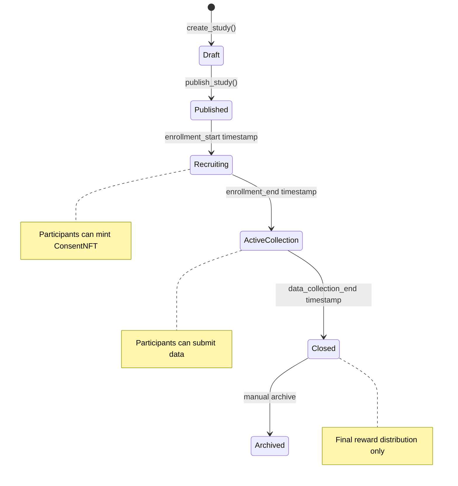

# RecruSearch Protocol Architecture Design
## Privacy-First Research Participation Protocol on Solana

---

## 1. Protocol Overview

RecruSearch is a decentralized, privacy-first research participation protocol built on Solana using Anchor. It enables pseudonymous, fraud-resistant data collection through encrypted off-chain storage and on-chain consent verification for sensitive academic and DeSci research studies.

### Core Value Proposition
- **Privacy-First:** Client-side encryption with off-chain storage
- **Fraud-Resistant:** Cryptographic verification and unique wallet-based participation
- **Incentive-Aligned:** Token-based rewards and NFT completion certificates
- **Compliance-Ready:** Verifiable consent and audit trails for institutional requirements

---

## 2. Program Structure Architecture

### 2.1 Core Programs

### 2.2 Program Responsibilities

| Program | Primary Responsibilities | Key Instructions |
|---------|-------------------------|------------------|
| **Study Program** | Study lifecycle management, eligibility validation, time-based state transitions | `create_study`, `publish_study`, `close_study` |
| **Consent NFT Program** | Consent verification, eligibility proof validation, NFT minting | `mint_consent_nft`, `verify_eligibility` |
| **Submission Program** | Encrypted data tracking, submission validation, completion verification | `submit_encrypted_data`, `verify_submission` |
| **Reward Vault Program** | Token escrow, time-locked releases, reward distribution | `create_reward_vault`, `distribute_reward` |
| **ZK Verification Program** | Zero-knowledge proof validation, privacy-preserving eligibility | `verify_zk_proof`, `validate_eligibility` |

---

## 3. Account Structure Mapping

### 3.1 Primary Account Types

### 3.2 Program-Derived Addresses (PDAs)

| Account Type | PDA Seeds | Purpose |
|--------------|-----------|---------|
| **StudyAccount** | `["study", researcher_pubkey, study_id]` | Unique study identification per researcher |
| **ConsentNFT** | `["consent", participant_pubkey, study_id]` | One consent per participant per study |
| **SubmissionAccount** | `["submission", participant_pubkey, study_id]` | One submission per participant per study |
| **RewardVault** | `["vault", study_account_pubkey]` | Study-specific reward escrow |
| **CompletionNFT** | `["completion", participant_pubkey, study_id]` | Completion certificate per participant |

---

## 4. User Interaction Flows

### 4.1 Researcher Flow

### 4.2 Participant Flow

### 4.3 Time-Based Study Management Flow

---

## 5. External Dependencies and Integrations

### 5.1 Blockchain Dependencies

### 5.2 Off-Chain Infrastructure

---

## 6. Advanced Technical Features

### 6.1 Zero-Knowledge Proof Integration

### 6.2 Time-Locked Escrow System

### 6.3 Compressed State Management

---

## 7. Security Architecture

### 7.1 Attack Vector Mitigation

| Attack Vector | Mitigation Strategy | Implementation |
|---------------|-------------------|----------------|
| **Double Consent** | PDA uniqueness | One ConsentNFT per wallet per study |
| **Fake Submissions** | Consent NFT verification | Require valid ConsentNFT for submission |
| **Reward Gaming** | Escrow + verification | Time-locked rewards with completion proof |
| **Study Manipulation** | Immutable post-publish | Study parameters locked after publication |
| **Privacy Breach** | Client-side encryption | Data encrypted before off-chain storage |
| **Eligibility Fraud** | ZK proofs + Merkle trees | Cryptographic proof without data exposure |

### 7.2 Access Control Matrix

---

## 8. Performance and Scalability

### 8.1 Transaction Cost Analysis

| Operation | Estimated SOL Cost | Account Changes | Compute Units |
|-----------|-------------------|-----------------|---------------|
| Create Study | ~0.002 SOL | +1 StudyAccount | ~15,000 CU |
| Mint Consent NFT | ~0.003 SOL | +1 ConsentNFT, +1 Metadata | ~25,000 CU |
| Submit Data | ~0.001 SOL | +1 SubmissionAccount | ~10,000 CU |
| Distribute Reward | ~0.002 SOL | Token transfer + NFT mint | ~20,000 CU |
| Batch Operations | ~0.001 SOL per participant | Merkle proof verification | ~5,000 CU |

### 8.2 Scalability Metrics

---

## 9. Compliance and Audit Framework

### 9.1 Regulatory Requirements

### 9.2 Audit Trail Components

| Component | Data Captured | Verification Method |
|-----------|---------------|-------------------|
| **Consent Records** | Timestamp, wallet, study, consent hash | On-chain NFT metadata |
| **Eligibility Verification** | ZK proof hash, validation result | Cryptographic verification |
| **Data Submissions** | IPFS hash, submission time, participant | Immutable on-chain record |
| **Reward Distribution** | Amount, recipient, completion proof | SPL token transaction history |
| **Study Lifecycle** | State changes, timestamps, authority | Event log with signatures |

---

## 10. Deployment and Monitoring

### 10.1 Deployment Architecture

### 10.2 Monitoring Dashboard Metrics

| Metric Category | Key Indicators | Alert Thresholds |
|----------------|----------------|------------------|
| **Program Health** | Transaction success rate, CU usage | <95% success, >80% CU limit |
| **User Activity** | Daily active studies, new participants | <50% baseline activity |
| **Financial** | Reward distribution, vault balances | Unexpected balance changes |
| **Security** | Failed transactions, unauthorized access | Any security event |
| **Performance** | Transaction latency, confirmation time | >5s latency, >1min confirmation |

---

## 11. Future Enhancements

### 11.1 Roadmap Features

### 11.2 Potential Protocol Extensions

| Extension | Description | Technical Requirements |
|-----------|-------------|----------------------|
| **Multi-Chain Support** | Expand to other blockchains | Cross-chain bridge integration |
| **AI Data Analysis** | On-chain ML model integration | Confidential computing protocols |
| **Reputation System** | Participant and researcher ratings | Decentralized identity integration |
| **Study Marketplace** | Discover and fund research | Automated matching algorithms |
| **Real-Time Analytics** | Live study progress tracking | Event streaming infrastructure |

---

## Conclusion

RecruSearch represents a novel approach to research participation that prioritizes privacy, security, and user sovereignty while maintaining the rigor and compliance requirements of academic and clinical research. The architecture leverages Solana's high-performance blockchain capabilities, advanced cryptographic techniques, and user-friendly Web3 interfaces to create a comprehensive platform for ethical, efficient, and transparent research data collection.

The modular design ensures scalability and extensibility while the privacy-first approach addresses critical concerns in sensitive research domains. By combining on-chain verification with off-chain encrypted storage, RecruSearch establishes a new standard for research integrity in the Web3 era. 